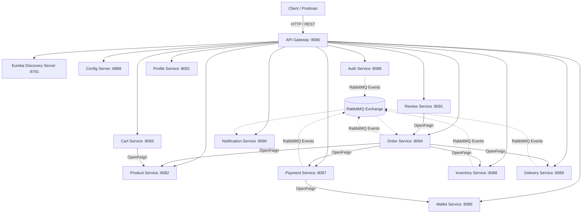
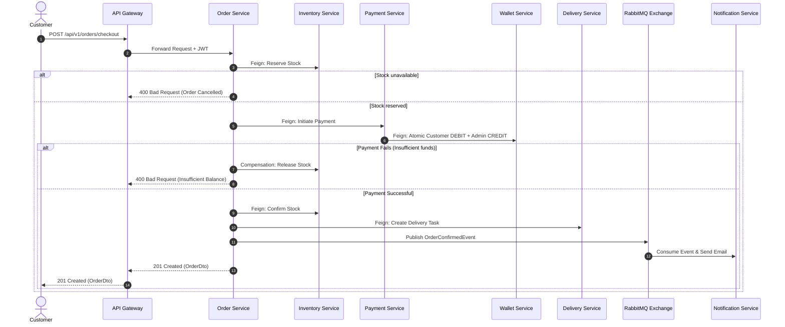

# EShopping Zone - Production Microservices Backend

EShopping Zone is an enterprise-grade, event-driven e-commerce backend built with **Java 17+**, **Spring Boot 3.3.4**, **Spring Cloud 2023.0.3**, **MySQL 8**, **RabbitMQ**, **OpenFeign**, and **Resilience4j**.

---

## 🏛️ Architecture Overview

The system strictly enforces **database-per-service isolation** across 11 independent business services and 3 infrastructure services.



---

## 📦 Microservices Directory & Ports

| Service Name | Port | Database | Responsibilities |
| :--- | :--- | :--- | :--- |
| **`eureka-server`** | `8761` | N/A | Service discovery & registry |
| **`config-server`** | `8888` | Native / Git | Centralized configuration management |
| **`api-gateway`** | `8080` | N/A | Gateway routing, CORS, correlation ID injection |
| **`auth-service`** | `8086` | `auth_db` | User registration, JWT auth, refresh tokens, SHA-256 password resets |
| **`profile-service`** | `8081` | `profile_db` | User profile details, multiple shipping addresses |
| **`product-service`** | `8082` | `product_db` | Product catalog, categories, search, merchant ownership moderation |
| **`cart-service`** | `8083` | `cart_db` | Shopping cart items, authoritative price validation via Feign |
| **`order-service`** | `8084` | `order_db` | Checkout Saga orchestrator, order lifecycle, compensation |
| **`wallet-service`** | `8085` | `wallet_db` | Digital wallet, top-up, atomic Customer $\leftrightarrow$ Admin transfers |
| **`payment-service`** | `8087` | `payment_db` | Wallet payments, Cash on Delivery (COD), refund processing |
| **`inventory-service`** | `8088` | `inventory_db` | Stock reservation, release, confirmation, low-stock events |
| **`delivery-service`** | `8089` | `delivery_db` | Dispatch management, tracking numbers, agent lifecycle |
| **`notification-service`**| `8090` | `notification_db` | Event-driven multi-channel email/alert delivery |
| **`review-service`** | `8091` | `review_db` | Product ratings, reviews, verified purchase verification |

---

## 🔐 Security & Roles Matrix

The platform enforces 4 explicit roles:
- `CUSTOMER`: Cart management, checkout, wallet balance, order history, writing reviews.
- `MERCHANT`: Product management (catalog updates), inventory updates for own products.
- `DELIVERY_AGENT`: Viewing assigned deliveries, updating shipment status, confirming COD cash collections.
- `ADMIN`: Global order oversight, product approvals/moderation, wallet management, dispatching delivery tasks, broadcasting notifications.

---

## 🚀 Getting Started

### Prerequisites
- **Java 17+**
- **Maven 3.9+**
- **Docker & Docker Compose**

### 1. Build and Test Entire Project
```bash
mvn clean install
```

### 2. Launch Entire Infrastructure & Microservices via Docker Compose
```bash
docker-compose up -d --build
```

### 3. Verify Health & Discovery
- **Eureka Dashboard**: [http://localhost:8761](http://localhost:8761)
- **API Gateway**: [http://localhost:8080](http://localhost:8080)
- **RabbitMQ Management**: [http://localhost:15672](http://localhost:15672) (User/Pass: `guest`/`guest`)
- **MailHog UI**: [http://localhost:8025](http://localhost:8025)

---

## 🔄 Distributed Saga Checkout Sequence


